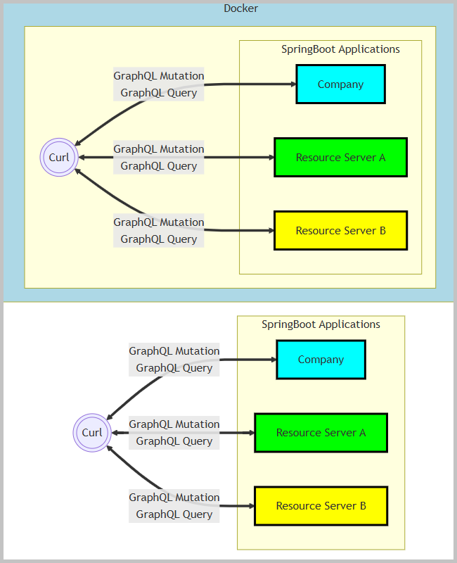
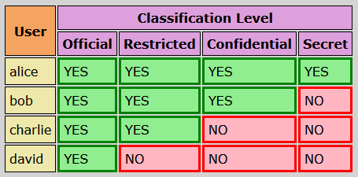
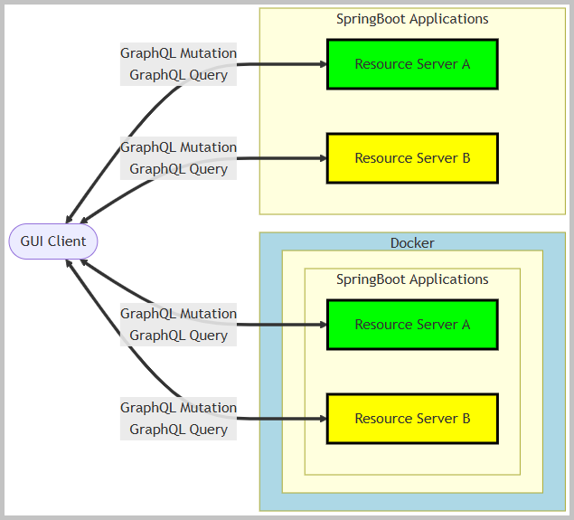
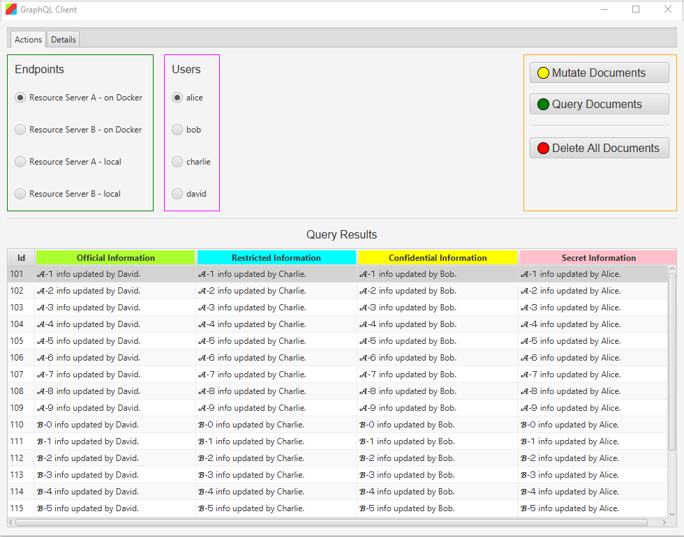

<!DOCTYPE html>
<html lang="en">
<meta charset="UTF-8">
<body>

<h2 id="contents">Study25 README Contents</h2>

<h3 id="top">Research <a href="https://graphql.org/">GraphQL</a> over HTTP</h3>

    GraphQL’s conceptual model is an entity graph. 
    The GraphQL server operates on a single URL/endpoint, usually at '/graphql'.

    The Spring Boot application <b>"company"</b> serves as a resource server for company data,
    handling GraphQL API requests.

    The Spring Boot applications <b>"resource-server-a"</b> and <b>"resource-server-b"</b>
    act as a resource server for classified information,
    handling GraphQL API requests and ensuring proper authorization.

    Key Difference between application <b>"resource-server-a"</b> and application <b>"resource-server-b"</b>:

<ul>
    <li>
        In application <b>"resource-server-a"</b> authorization is enforced in Java code (controller/service methods)
        using Spring Security annotations. The GraphQL schema does not reflect access controls.
    </li>
    <li>
        In application <b>"resource-server-b"</b> authorization is declared and enforced
        via custom directives within the GraphQL schema, and realized through custom directive wiring logic.
        The GraphQL schema itself specifies access rules, making them transparent to API consumers.
    </li>
</ul>

    The JavaFX application <b>"gui-client"</b> functions as a GraphQL client.

    Project sections:

<ol>
    <li><a href="#ONE"><b>Business Logic</b></a></li>
    <li><a href="#TWO"><b>Docker Build</b></a></li>
    <li><a href="#THREE"><b>Curl Client on Docker</b></a></li>
    <li><a href="#FOUR"><b>Local Curl Clients</b></a></li>
    <li><a href="#FIVE"><b>GUI Client</b></a></li>
</ol>

    Java source code packages: 
     
    
    <i>project 'Study25-company', application sources</i>&nbsp;:&nbsp;
    <a href="https://github.com/k1729p/Study25/tree/main/company/src/main/java/kp/company">kp</a> 
    
    <i>project 'Study25-company', test sources</i>&nbsp;:&nbsp;
    <a href="https://github.com/k1729p/Study25/tree/main/company/src/test/java/kp/company">kp</a> 
    
    <i>project 'Study25-resource-server-common', application sources</i>&nbsp;:&nbsp;
    <a href="https://github.com/k1729p/Study25/tree/main/resource-server-common/src/main/java/kp/resource/server">kp</a> 
    
    <i>project 'Study25-resource-server-a', application sources</i>&nbsp;:&nbsp;
    <a href="https://github.com/k1729p/Study25/tree/main/resource-server-a/src/main/java/kp/resource/server/a">kp</a> 
    
    <i>project 'Study25-resource-server-a', test sources</i>&nbsp;:&nbsp;
    <a href="https://github.com/k1729p/Study25/tree/main/resource-server-a/src/test/java/kp/resource/server/a">kp</a> 
    
    <i>project 'Study25-resource-server-b', application sources</i>&nbsp;:&nbsp;
    <a href="https://github.com/k1729p/Study25/tree/main/resource-server-b/src/main/java/kp/resource/server/b">kp</a> 
    
    <i>project 'Study25-resource-server-b', test sources</i>&nbsp;:&nbsp;
    <a href="https://github.com/k1729p/Study25/tree/main/resource-server-b/src/test/java/kp/resource/server/b">kp</a> 
    
    <i>project 'Study25-gui-client', application sources</i>&nbsp;:&nbsp;
    <a href="https://github.com/k1729p/Study25/tree/main/gui-client/src/main/java/kp/client">kp</a> 
    

     
    
    <i>project 'Study25-company'</i>&nbsp;:&nbsp;
    <a href="https://htmlpreview.github.io/?https://github.com/k1729p/Study25/blob/main/company/docs/apidocs/overview-tree.html">
        Java API Documentation</a>&nbsp;●&nbsp;
    <a href="https://htmlpreview.github.io/?https://github.com/k1729p/Study25/blob/main/company/docs/testapidocs/overview-tree.html">
        Java Test API Documentation</a> 
    
    <i>project 'Study25-resource-server-common'</i>&nbsp;:&nbsp;
    <a href="https://htmlpreview.github.io/?https://github.com/k1729p/Study25/blob/main/resource-server-common/docs/apidocs/overview-tree.html">
        Java API Documentation</a> 
    
    <i>project 'Study25-resource-server-a'</i>&nbsp;:&nbsp;
    <a href="https://htmlpreview.github.io/?https://github.com/k1729p/Study25/blob/main/resource-server-a/docs/apidocs/overview-tree.html">
        Java API Documentation</a>&nbsp;●&nbsp;
    <a href="https://htmlpreview.github.io/?https://github.com/k1729p/Study25/blob/main/resource-server-a/docs/testapidocs/overview-tree.html">
        Java Test API Documentation</a> 
    
    <i>project 'Study25-resource-server-b'</i>&nbsp;:&nbsp;
    <a href="https://htmlpreview.github.io/?https://github.com/k1729p/Study25/blob/main/resource-server-b/docs/apidocs/overview-tree.html">
        Java API Documentation</a>&nbsp;●&nbsp;
    <a href="https://htmlpreview.github.io/?https://github.com/k1729p/Study25/blob/main/resource-server-b/docs/testapidocs/overview-tree.html">
        Java Test API Documentation</a> 
    
    <i>project 'Study25-gui-client'</i>&nbsp;:&nbsp;
    <a href="https://htmlpreview.github.io/?https://github.com/k1729p/Study25/blob/main/gui-client/docs/apidocs/overview-tree.html">
        Java API Documentation</a> 
    

<a href="#top">Back to the top of the page</a>

<h3 id="ONE">❶ Business Logic</h3>

    1.1. GraphQL schema definitions.

<table style="border:solid"><tbody>
<tr>
    <td style="border:solid"><i>company</i></td>
    <td style="border:solid">
        <a href="https://github.com/k1729p/Study25/blob/main/company/src/main/resources/graphql/schema.graphqls">
            schema.graphqls</a>
    </td>
</tr><tr>
    <td style="border:solid"><i>resource-server-a</i></td>
    <td style="border:solid">
        <a href="https://github.com/k1729p/Study25/blob/main/resource-server-a/src/main/resources/graphql/schema.graphqls">
            schema.graphqls</a></td>
</tr><tr>
    <td style="border:solid"><i>resource-server-b</i></td>
    <td style="border:solid">
        <a href="https://github.com/k1729p/Study25/blob/main/resource-server-b/src/main/resources/graphql/schema.graphqls">
            schema.graphqls</a></td>
</tr>
</tbody></table>

    1.2.1.  The <b>"company"</b> application. Controller method for mutations:

<ul>
    <li>
        <a href="https://github.com/k1729p/Study25/blob/main/company/src/main/java/kp/company/controllers/DepartmentController.java#L36">
            kp.company.controllers.DepartmentController::mutateDepartments</a>
    </li>
</ul>

    1.2.2.  The <b>"company"</b> application. Controller methods for queries:

<ul>
    <li>
        <a href="https://github.com/k1729p/Study25/blob/main/company/src/main/java/kp/company/controllers/DepartmentController.java#L49">
            kp.company.controllers.DepartmentController::queryDepartments</a>
    </li>
    <li>
        <a href="https://github.com/k1729p/Study25/blob/main/company/src/main/java/kp/company/controllers/DepartmentController.java#L62">
            kp.company.controllers.DepartmentController::queryDepartmentById</a>
    </li>
    <li>
        <a href="https://github.com/k1729p/Study25/blob/main/company/src/main/java/kp/company/controllers/DepartmentController.java#L80">
            kp.company.controllers.DepartmentController::queryEmployeesCountByTitle</a>
    </li>
</ul>

    1.3. The resource servers manage documents classified under four classification levels. 
    Four users are assigned specific roles corresponding to their access levels.

    

    1.4.1. The <b>"resource-server-a"</b> application purpose. 
    Implements classification-level access control for document data
    using Spring Security annotations directly on controller methods.
    Each GraphQL mutation and query, as well as each classified field accessor
    (e.g., officialInformation, restrictedInformation), is protected using @PreAuthorize
    with a specific role required for access.

    1.4.2. The <b>"resource-server-a"</b> application authorization logic:

<ul>
    <li>
        Access control is enforced at the Java method level using @PreAuthorize("hasRole(...)").
    </li>
    <li>
        Each operation (query, mutation, field resolution) checks the user's role before execution.
    </li>
    <li>
        The GraphQL schema is unaware of authorization; all restrictions are enforced in the backend controller code.
    </li>
</ul>

    1.4.3. The <b>"resource-server-a"</b> application. Controller methods for mutations:

<ul>
    <li>
        <a href="https://github.com/k1729p/Study25/blob/main/resource-server-a/src/main/java/kp/resource/server/a/controllers/DocumentMutationController.java#L42">
            kp.resource.server.a.controllers.DocumentMutationController::mutateDocumentClassificationLevelOfficial</a>
    </li>
    <li>
        <a href="https://github.com/k1729p/Study25/blob/main/resource-server-a/src/main/java/kp/resource/server/a/controllers/DocumentMutationController.java#L65">
            kp.resource.server.a.controllers.DocumentMutationController::mutateDocumentClassificationLevelRestricted</a>
    </li>
    <li>
        <a href="https://github.com/k1729p/Study25/blob/main/resource-server-a/src/main/java/kp/resource/server/a/controllers/DocumentMutationController.java#L88">
            kp.resource.server.a.controllers.DocumentMutationController::mutateDocumentClassificationLevelConfidential</a>
    </li>
    <li>
        <a href="https://github.com/k1729p/Study25/blob/main/resource-server-a/src/main/java/kp/resource/server/a/controllers/DocumentMutationController.java#L111">
            kp.resource.server.a.controllers.DocumentMutationController::mutateDocumentClassificationLevelSecret</a>
    </li>
    <li>
        <a href="https://github.com/k1729p/Study25/blob/main/resource-server-a/src/main/java/kp/resource/server/a/controllers/DocumentMutationController.java#L133">
            kp.resource.server.a.controllers.DocumentMutationController::deleteAllDocuments</a>
    </li>
</ul>

    1.4.4. The <b>"resource-server-a"</b> application. Controller methods for queries:

<ul>
    <li>
        <a href="https://github.com/k1729p/Study25/blob/main/resource-server-a/src/main/java/kp/resource/server/a/controllers/DocumentQueryController.java#L41">
            kp.resource.server.a.controllers.DocumentQueryController::queryDocument</a>
    </li>
    <li>
        <a href="https://github.com/k1729p/Study25/blob/main/resource-server-a/src/main/java/kp/resource/server/a/controllers/DocumentQueryController.java#L58">
            kp.resource.server.a.controllers.DocumentQueryController::getOfficialInformation</a>
    </li>
    <li>
        <a href="https://github.com/k1729p/Study25/blob/main/resource-server-a/src/main/java/kp/resource/server/a/controllers/DocumentQueryController.java#L76">
            kp.resource.server.a.controllers.DocumentQueryController::getRestrictedInformation</a>
    </li>
    <li>
        <a href="https://github.com/k1729p/Study25/blob/main/resource-server-a/src/main/java/kp/resource/server/a/controllers/DocumentQueryController.java#L94">
            kp.resource.server.a.controllers.DocumentQueryController::getConfidentialInformation</a>
    </li>
    <li>
        <a href="https://github.com/k1729p/Study25/blob/main/resource-server-a/src/main/java/kp/resource/server/a/controllers/DocumentQueryController.java#L112">
            kp.resource.server.a.controllers.DocumentQueryController::getSecretInformation</a>
    </li>
</ul>

    1.5.1. The <b>"resource-server-b"</b> application purpose. 
    Implements a more declarative, schema-driven approach to classification-level access control
    using custom GraphQL directives. The schema itself defines authorization requirements
    for operations and for individual fields.

    1.5.2. The <b>"resource-server-b"</b> application authorization logic:

<ul>
    <li>
        Uses a custom @auth(role: ...) directive in the GraphQL schema to declare required roles
        for each mutation and for classified fields (official, restricted, confidential, secret).
    </li>
    <li>
        A custom <a href="https://github.com/k1729p/Study25/blob/main/resource-server-b/src/main/java/kp/resource/server/b/configuration/AuthorisationDirectiveWiring.java">
            kp.resource.server.b.configuration.AuthorisationDirectiveWiring</a>
        component implements how these directives enforce security at runtime.
        It injects authorization checks into the GraphQL execution layer, based on the directive's role argument.
    </li>
    <li>
        The enforcement is handled during schema wiring/configuration, making the schema self-documenting
        in terms of access control.
    </li>
</ul>

    1.5.3. The <b>"resource-server-b"</b> directive use: 
    The @auth(role: ...) directive is attached directly in schema.graphqls to mutations and classified fields,
    specifying which user role is required to access or mutate that data.
    This approach centralizes and exposes authorization logic at the schema level,
    rather than scattering it through controller annotations.

    1.5.4. The <b>"resource-server-b"</b> application. Controller methods for mutations:

<ul>
    <li>
        <a href="https://github.com/k1729p/Study25/blob/main/resource-server-b/src/main/java/kp/resource/server/b/controllers/DocumentMutationController.java#L38">
            kp.resource.server.b.controllers.DocumentMutationController::mutateDocumentClassificationLevelOfficial</a>
    </li>
    <li>
        <a href="https://github.com/k1729p/Study25/blob/main/resource-server-b/src/main/java/kp/resource/server/b/controllers/DocumentMutationController.java#L60">
            kp.resource.server.b.controllers.DocumentMutationController::mutateDocumentClassificationLevelRestricted</a>
    </li>
    <li>
        <a href="https://github.com/k1729p/Study25/blob/main/resource-server-b/src/main/java/kp/resource/server/b/controllers/DocumentMutationController.java#L82">
            kp.resource.server.b.controllers.DocumentMutationController::mutateDocumentClassificationLevelConfidential</a>
    </li>
    <li>
        <a href="https://github.com/k1729p/Study25/blob/main/resource-server-b/src/main/java/kp/resource/server/b/controllers/DocumentMutationController.java#L104">
            kp.resource.server.b.controllers.DocumentMutationController::mutateDocumentClassificationLevelSecret</a>
    </li>
    <li>
        <a href="https://github.com/k1729p/Study25/blob/main/resource-server-b/src/main/java/kp/resource/server/b/controllers/DocumentMutationController.java#L125">
            kp.resource.server.b.controllers.DocumentMutationController::deleteAllDocuments</a>
    </li>
</ul>

    1.5.5. The <b>"resource-server-b"</b> application. Controller methods for queries:

<ul>
    <li>
        <a href="https://github.com/k1729p/Study25/blob/main/resource-server-b/src/main/java/kp/resource/server/b/controllers/DocumentQueryController.java#L37">
            kp.resource.server.b.controllers.DocumentQueryController::queryDocument</a>
    </li>
    <li>
        <a href="https://github.com/k1729p/Study25/blob/main/resource-server-b/src/main/java/kp/resource/server/b/controllers/DocumentQueryController.java#L53">
            kp.resource.server.b.controllers.DocumentQueryController::getOfficialInformation</a>
    </li>
    <li>
        <a href="https://github.com/k1729p/Study25/blob/main/resource-server-b/src/main/java/kp/resource/server/b/controllers/DocumentQueryController.java#L70">
            kp.resource.server.b.controllers.DocumentQueryController::getRestrictedInformation</a>
    </li>
    <li>
        <a href="https://github.com/k1729p/Study25/blob/main/resource-server-b/src/main/java/kp/resource/server/b/controllers/DocumentQueryController.java#L87">
            kp.resource.server.b.controllers.DocumentQueryController::getConfidentialInformation</a>
    </li>
    <li>
        <a href="https://github.com/k1729p/Study25/blob/main/resource-server-b/src/main/java/kp/resource/server/b/controllers/DocumentQueryController.java#L104">
            kp.resource.server.b.controllers.DocumentQueryController::getSecretInformation</a>
    </li>
</ul>

<a href="#top">Back to the top of the page</a>

<h3 id="TWO">❷ Docker Build</h3>

Action: 
     
     Use the batch file
    <a href="https://github.com/k1729p/Study25/blob/main/0_batch/01%20Docker%20compose.bat">
        <i>"01 Docker compose.bat"</i></a> to build the images and start the containers. 
    

    2.1. Docker images are built using the following files:

<ul>
    <li><a href="https://raw.githubusercontent.com/k1729p/Study25/main/docker-config/Company.Dockerfile">
        <b>"Company.Dockerfile"</b></a></li>
    <li><a href="https://raw.githubusercontent.com/k1729p/Study25/main/docker-config/Resource-Server-A.Dockerfile">
        <b>"Resource-Server-A.Dockerfile"</b></a></li>
    <li><a href="https://raw.githubusercontent.com/k1729p/Study25/main/docker-config/Resource-Server-B.Dockerfile">
        <b>"Resource-Server-B.Dockerfile"</b></a></li>
    <li><a href="https://raw.githubusercontent.com/k1729p/Study25/main/docker-config/GraphQL-Client.Dockerfile">
        <b>"GraphQL-Client.Dockerfile"</b></a></li>
    <li><a href="https://raw.githubusercontent.com/k1729p/Study25/main/docker-config/compose.yaml">
        <b>"compose.yaml"</b></a></li>
</ul>

    2.2. The <a href="images/ScreenshotDockerContainers.png">screenshot</a>
    shows the created Docker containers.

<a href="#top">Back to the top of the page</a>

<h3 id="THREE">❸ Curl Client on Docker</h3>

Action: 
     
     Use the batch file
    <a href="https://github.com/k1729p/Study25/blob/main/0_batch/02%20CURL%20on%20Docker.bat">
        <i>"02 CURL on Docker.bat"</i></a> to execute the shell scripts 
    
    &nbsp; <a href="https://raw.githubusercontent.com/k1729p/Study25/refs/heads/main/docker-config/tests/call_graphql_endpoint_company.sh">
        "call_graphql_endpoint_company.sh"</a> and
    <a href="https://raw.githubusercontent.com/k1729p/Study25/refs/heads/main/docker-config/tests/call_graphql_endpoint_resource_server.sh">
        "call_graphql_endpoint_resource_server.sh"</a>. 
    

    3.1. Testing the <b>"company"</b> application.

    The directory with GraphQL queries:
    <a href="https://github.com/k1729p/Study25/tree/main/docker-config/tests/queries/company">'company'</a>. 
    The <a href="images/ScreenshotCurlDockerCompany.png">screenshot</a>
    shows the results of running "call_graphql_endpoint_company.sh".

    3.2. Testing the <b>"resource-server-a"</b> and <b>"resource-server-b"</b> applications.

    The directory with GraphQL queries:
    <a href="https://github.com/k1729p/Study25/tree/main/docker-config/tests/queries/resource-server">'resource-server'</a>. 
    The <a href="images/ScreenshotCurlDockerResourceServerA.png">screenshot</a>
    shows the results of running "call_graphql_endpoint_resource_server.sh resource-server-a 8082". 
    The <a href="images/ScreenshotCurlDockerResourceServerB.png">screenshot</a>
    shows the results of running "call_graphql_endpoint_resource_server.sh resource-server-b 8083".

<a href="#top">Back to the top of the page</a>

<h3 id="FOUR">❹ Local Curl Clients</h3>

Action: 
     
    
    1. Use the batch file
    <a href="https://github.com/k1729p/Study25/blob/main/0_batch/03%20MVN%20build%20and%20start%20local.bat">
        <i>"03 MVN build and start local.bat"</i></a>. 
    
    &nbsp; to build and start the applications 'Company', 'Resource Server A', and 'Resource Server B' locally. 
    
    2. Start the Windows batch script
    <a href="https://github.com/k1729p/Study25/blob/main/0_batch/04%20CURL%20local%20'company'.bat">
        <i>"04 CURL local 'company'.bat"</i></a>. 
    
    3. Start the Windows batch script
    <a href="https://github.com/k1729p/Study25/blob/main/0_batch/05%20CURL%20local%20'resource-server-a'.bat">
        <i>"05 CURL local 'resource-server-a'.bat"</i></a> 
    
    &nbsp; (calls the script <a href="https://github.com/k1729p/Study25/blob/main/0_batch/scripts/resource_server_local.bat">
        <i>"resource_server_local.bat"</i></a>). 
    
    4. Start the Windows batch script
    <a href="https://github.com/k1729p/Study25/blob/main/0_batch/06%20CURL%20local%20'resource-server-b'.bat">
        <i>"06 CURL local 'resource-server-b'.bat"</i></a> 
    
    &nbsp; (calls the script <a href="https://github.com/k1729p/Study25/blob/main/0_batch/scripts/resource_server_local.bat">
        <i>"resource_server_local.bat"</i></a>). 
    

    4.1. The <a href="images/ScreenshotCurlLocalCompany.png">screenshot</a>
    shows the results of running "04 CURL local 'company'.bat".

    4.2. The <a href="images/ScreenshotCurlLocalResourceServerA.png">screenshot</a>
    shows the results of running "05 CURL local 'resource-server-a'.bat".

    4.3. The <a href="images/ScreenshotCurlLocalResourceServerB.png">screenshot</a>
    shows the results of running "06 CURL local 'resource-server-b'.bat".

<a href="#top">Back to the top of the page</a>

<h3 id="FIVE">❺ GUI Client</h3>
 

Action: 
     
    
    1. Use the batch file
    <a href="https://github.com/k1729p/Study25/blob/main/0_batch/07%20MVN%20build%20and%20start%20GUI%20client.bat">
        <i>"07 MVN build and start GUI client.bat"</i></a>. 
    
    &nbsp; to build and start the GUI client application. 
    
    2. Execute GraphQL client calls in the started GUI client, on the "Actions" tab. 
    
    3. In the "Endpoints" group, select "Resource Server A - on Docker". 
    
    4. In the "Users" group, select "alice". 
    
    &nbsp; This user has access with the classification level "secret". 
    
    5. Press the "Delete all documents" button and the "Mutate documents" button. 
    
    6. In the "Users" group, select "bob" and press "Mutate documents". 
    
    &nbsp; This user has access with the classification level "confidential". 
    
    7. In the "Users" group, select "charlie" and press "Mutate documents". 
    
    &nbsp; This user has access with the classification level "restricted". 
    
    8. In the "Users" group, select "david" and press "Mutate documents". 
    
    &nbsp; This user has access with the classification level "official". 
    
    9. In the "Users" group, select "alice" and press "Query documents". 
    

    5.1. The query results in the GUI client:

    The expected results in the "Query Results" table of the GUI client demonstrate that
    each user can only update information corresponding to their classification level or lower,
    with the latest update at each level overwriting previous ones.
    As shown in the screenshot, the sequence of mutations by users with decreasing classification levels
    ("secret" → "confidential" → "restricted" → "official") results in each row reflecting the most recent update
    allowed by the user's access rights.
    For example, the "official" information is overwritten successively by alice, bob, charlie, and finally david,
    confirming proper enforcement of access control and update permissions.

    5.2. The GUI client service methods:

<ul>
    <li>
        <a href="https://github.com/k1729p/Study25/blob/main/gui-client/src/main/java/kp/client/services/DocumentMutationService.java#L21">
            kp.client.services.DocumentMutationService::mutateDocuments</a>
    </li>
    <li>
        <a href="https://github.com/k1729p/Study25/blob/main/gui-client/src/main/java/kp/client/services/DocumentQueryService.java#L25">
            kp.client.services.DocumentQueryService::queryDocuments</a>
    </li>
</ul>

<a href="#top">Back to the top of the page</a>

<h3>Links</h3>
<ul>
    <li><a href="https://graphql.org/learn/">Learn GraphQL</a></li>
    <li><a href="https://docs.spring.io/spring-graphql/reference/">Spring for GraphQL</a></li>
    <li><a href="https://docs.spring.io/spring-graphql/docs/current-SNAPSHOT/api/">Spring for GraphQL API</a></li>
    <li><a href="https://spring.io/guides/gs/graphql-server">Spring Guides GraphQL Server</a></li>
    <li><a href="https://spec.graphql.org/October2021/">GraphQL Specification</a></li>
</ul>

<h3>Acronyms</h3>
<table style="border:solid">
    <tbody>
    <tr><td style="border:solid"><b>AST</b></td><td style="border:solid">Abstract Syntax Tree</td></tr>
    <tr><td style="border:solid"><b>DGS</b></td><td style="border:solid">Domain Graph Service</td></tr>
    <tr><td style="border:solid"><b>SDL</b></td><td style="border:solid">Schema Definition Language</td></tr>
    </tbody>
</table>
<a href="#top">Back to the top of the page</a>

</body>
</html>