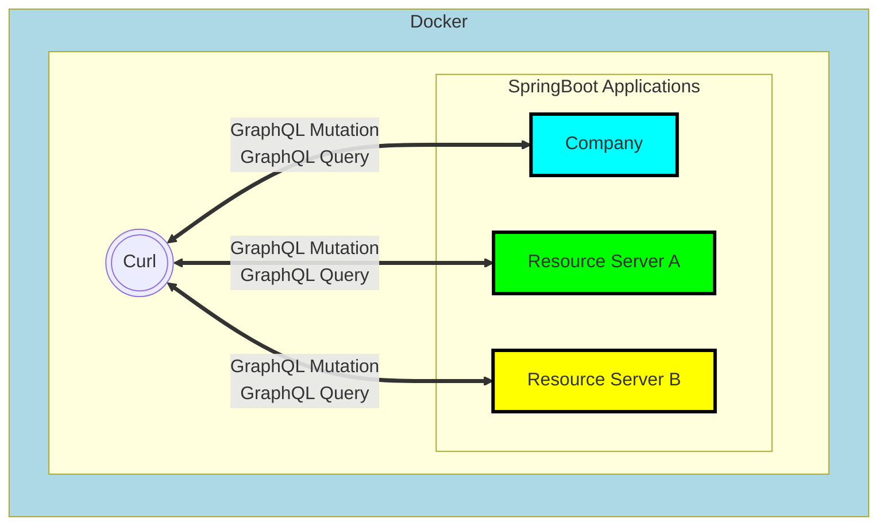
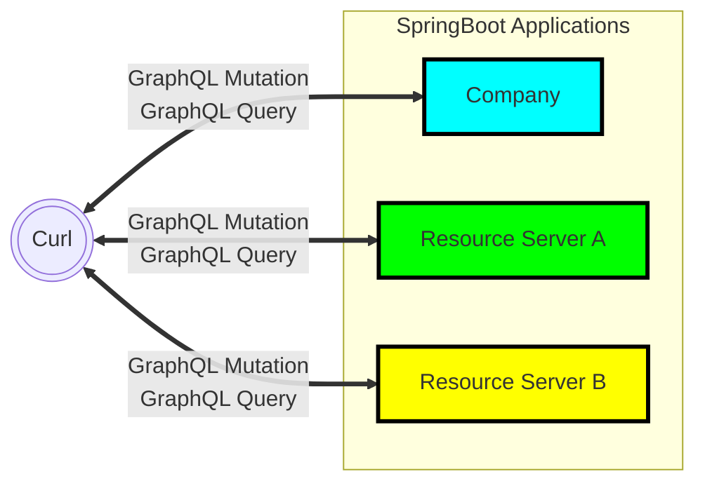
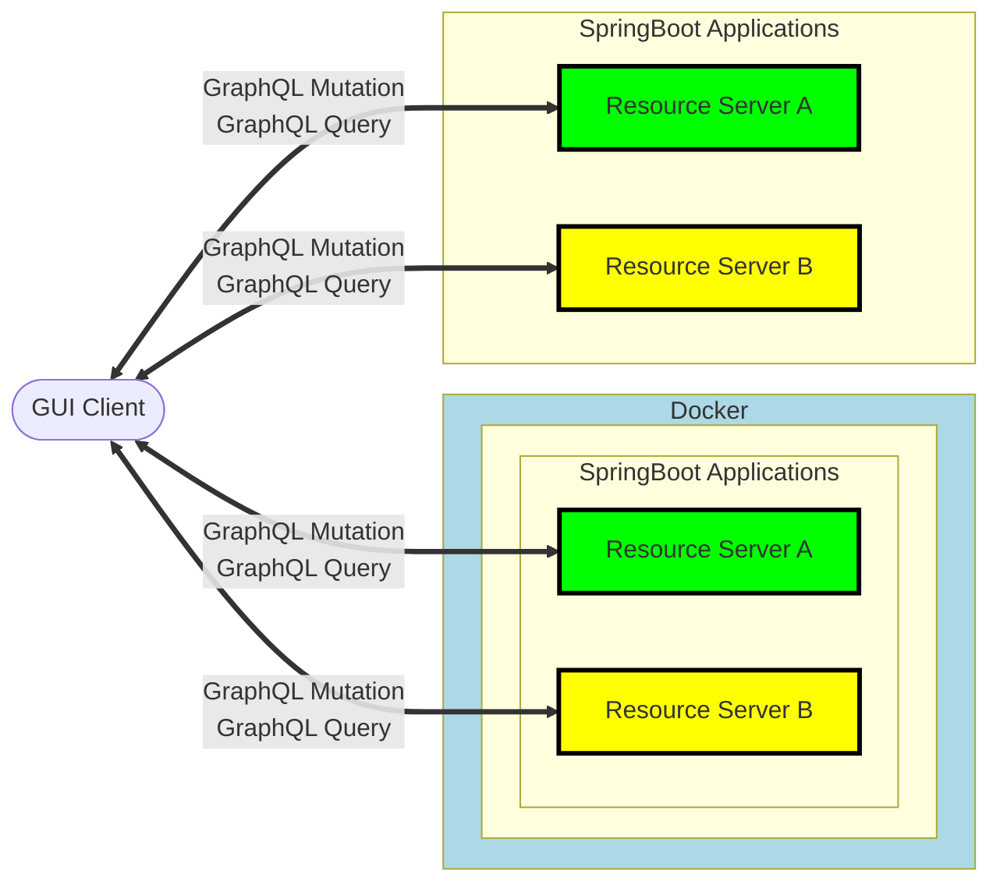

```mermaid
flowchart LR
    subgraph Docker
        subgraph " "
            CURL(((Curl)))
            subgraph SpringBoot Applications
                COM[Company]:::cyanBox
                RSA[Resource Server A]:::greenBox
                RSB[Resource Server B]:::yellowBox
            end
        end
    end
%% Flows
    CURL <== GraphQL Mutation<br>GraphQL Query ==> COM
    CURL <== GraphQL Mutation<br>GraphQL Query ==> RSA
    CURL <== GraphQL Mutation<br>GraphQL Query ==> RSB
%% Style Definitions
    style Docker fill: lightblue
    classDef greenBox fill: #00ff00, stroke: #000, stroke-width: 3px
    classDef cyanBox fill: #00ffff, stroke: #000, stroke-width: 3px
    classDef yellowBox fill: #ffff00, stroke: #000, stroke-width: 3px
```

```mermaid
flowchart LR
    subgraph SpringBoot Applications
        COM[Company]:::cyanBox
        RSA[Resource Server A]:::greenBox
        RSB[Resource Server B]:::yellowBox
    end
    CURL(((Curl)))
%% Flows
    CURL <== GraphQL Mutation<br>GraphQL Query ==> COM
    CURL <== GraphQL Mutation<br>GraphQL Query ==> RSA
    CURL <== GraphQL Mutation<br>GraphQL Query ==> RSB
%% Style Definitions
    classDef greenBox fill: #00ff00, stroke: #000, stroke-width: 3px
    classDef cyanBox fill: #00ffff, stroke: #000, stroke-width: 3px
    classDef yellowBox fill: #ffff00, stroke: #000, stroke-width: 3px
```

```mermaid
flowchart LR
    subgraph Docker
        subgraph " "
            subgraph SpringBoot Applications
                RSA-D[Resource Server A]:::greenBox
                RSB-D[Resource Server B]:::yellowBox
            end
        end
    end
    subgraph SpringBoot Applications
        RSA-L[Resource Server A]:::greenBox
        RSB-L[Resource Server B]:::yellowBox
    end
%% Flows
    GUI([GUI Client])
    GUI <== GraphQL Mutation<br>GraphQL Query ==> RSA-D
    GUI <== GraphQL Mutation<br>GraphQL Query ==> RSB-D
    GUI <== GraphQL Mutation<br>GraphQL Query ==> RSA-L
    GUI <== GraphQL Mutation<br>GraphQL Query ==> RSB-L
%% Style Definitions
    style Docker fill: lightblue
    classDef greenBox fill: #00ff00, stroke: #000, stroke-width: 3px
    classDef yellowBox fill: #ffff00, stroke: #000, stroke-width: 3px
```
